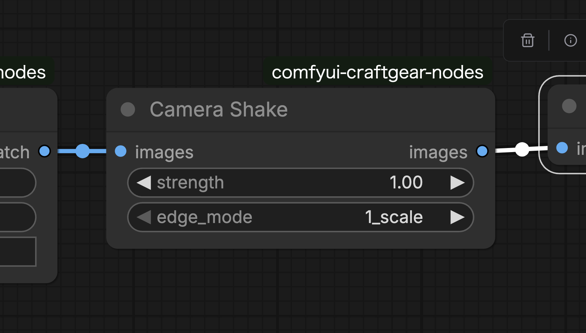

# Camera Shake

## Features

- Adds handheld camera-style shake effect to image batches.
- Generates smooth shake combining rotation and movement.
- Choose from 3 edge processing modes.

## Input Parameters

| Parameter | Type | Description |
|-----------|------|-------------|
| images | IMAGE | Image batch to apply shake effect |
| strength | FLOAT | Shake intensity (0.0 to 3.0, default: 1.0) |
| edge_mode | DROPDOWN | Edge processing mode |

## Edge Processing Modes

| Mode | Description |
|------|-------------|
| 1_scale | Scales up the image to fill gaps caused by shake |
| 2_crop | Crops and resizes after shake to return to original size |
| 3_prepad | Adds padding before applying shake, then crops at the end |

## Outputs

| Output | Type | Description |
|--------|------|-------------|
| images | IMAGE | Image batch with shake effect applied |

## Usage Example

Used when you want to add natural handheld shake to still images in video generation workflows. Setting strength low produces subtle shake, while high settings create dynamic shake.
