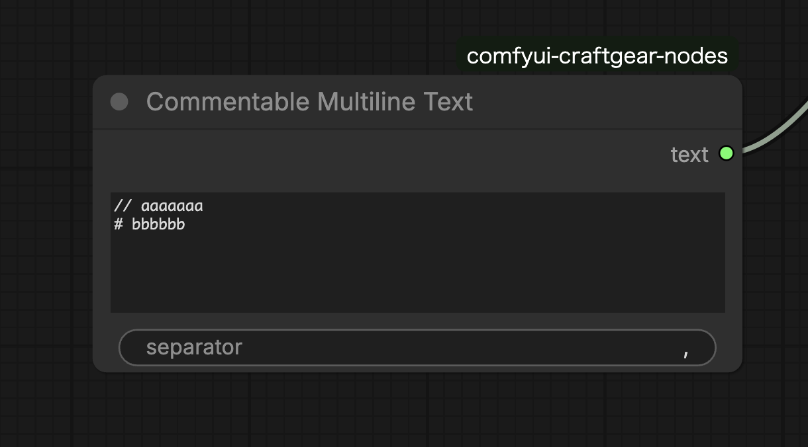

# Commentable Multiline Text



## Features

- Removes comment lines from multiline text and outputs the result.
- Lines starting with `#` or `//` are treated as comments and excluded from output.
- Useful for temporarily disabling parts of a prompt.


## Input Parameters

| Parameter | Type | Description |
|-----------|------|-------------|
| text | STRING | Multiline text input |
| separator | STRING | Separator for joining lines (default: `,`) |


## Outputs

| Output | Type | Description |
|--------|------|-------------|
| text | STRING | Text with comment lines removed, joined by separator |


## Comment Syntax

Comments can be written in the following formats:

```
# This is a comment (not output)
// This is also a comment (not output)
Valid text
  # Comments are recognized even after leading whitespace
```


## Usage Example

Used when organizing prompts while temporarily disabling some tags:

```
1girl
blue eyes
# red hair
blonde hair
// test tag
```

The above input outputs as `1girl, blue eyes, blonde hair`.
