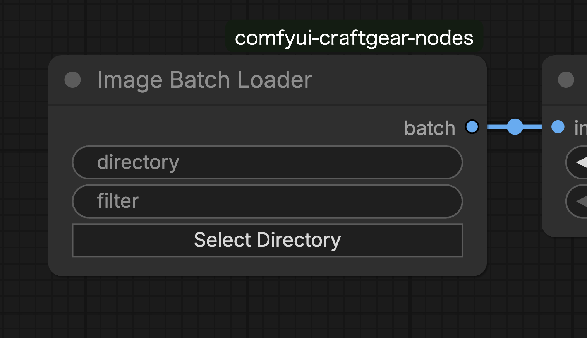

# Image Batch Loader

## Features

- Loads image files from a specified directory as a batch.
- Supports filename filtering with regular expressions.
- Only images of the same size are included in the batch.

## Input Parameters

| Parameter | Type | Description |
|-----------|------|-------------|
| directory | STRING | Path to directory containing image files |
| filter | STRING | Regular expression pattern for filtering filenames (empty for all files) |

## Outputs

| Output | Type | Description |
|--------|------|-------------|
| batch | IMAGE | Batch of loaded images |

## Supported Formats

- PNG (.png)
- JPEG (.jpg, .jpeg)
- WebP (.webp)

## Filter Pattern Examples

| Pattern | Description |
|---------|-------------|
| `frame` | Files containing "frame" in filename |
| `^img_` | Files starting with "img_" |
| `\d{4}` | Files containing 4 digits in filename |
| `\.png$` | PNG files only |

## Size Uniformity

For batch processing, only images with the same size as the first loaded image are included in the batch. Images of different sizes are automatically skipped.

## Usage Example

Used when processing sequential images as video or applying the same processing to multiple images.
