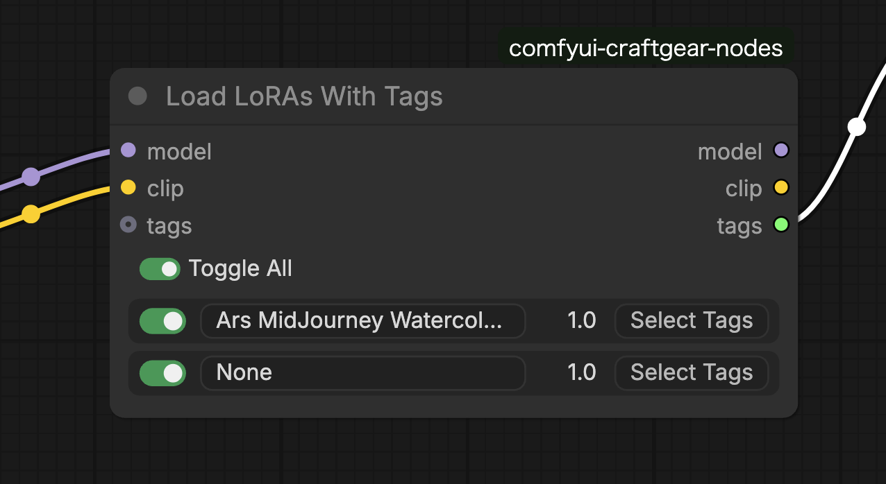
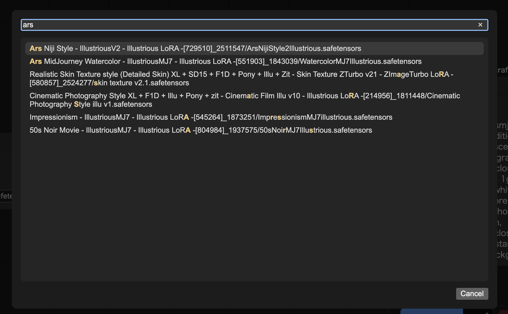
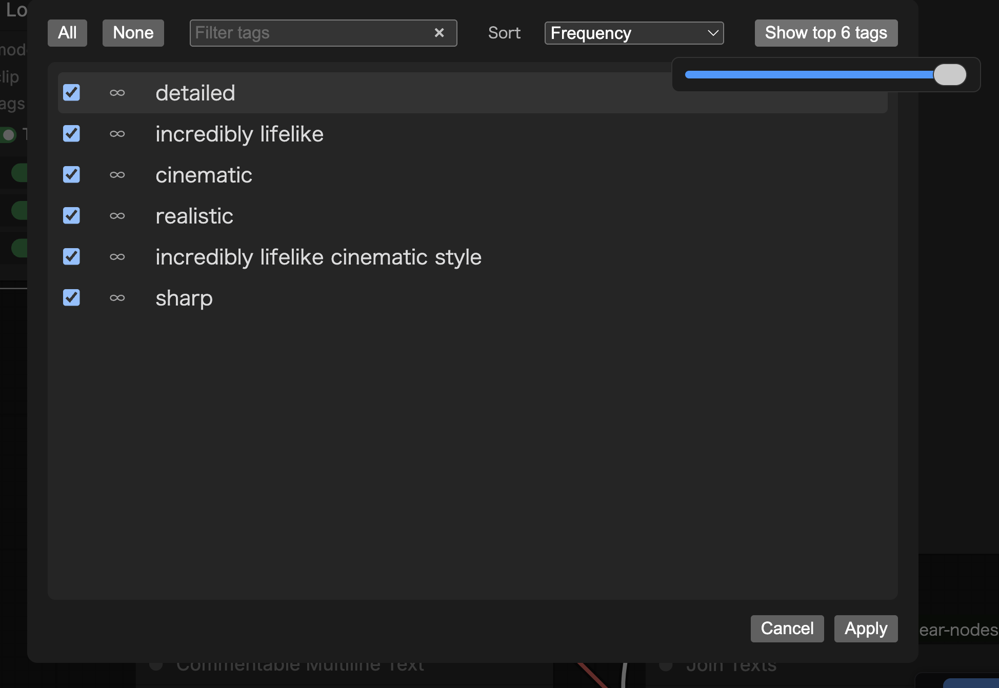
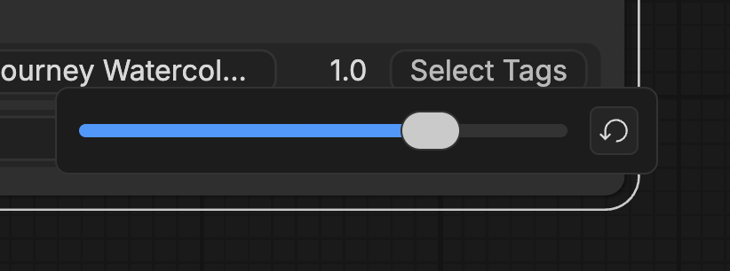
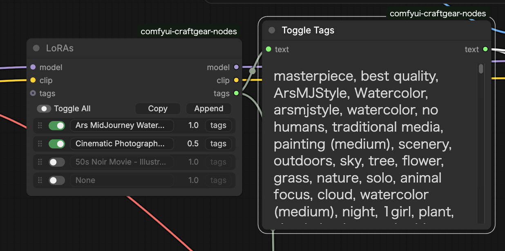

# Load Loras With Tags



## Features

- Load and select tags from LoRA's `ss_tag_strings` metadata and `trainedWords` from JSON files in the same directory as the model.
- Selected tags are output from the tags handle.
- LoRA selection can be done with fuzzy matching on filenames.
- Up to 10 LoRAs can be applied simultaneously.


## LoRA Selection Dialog

- LoRA names can be filtered with fuzzy matching. Quickly find the target from a large number of files.
- Select LoRA using up/down keys or mouse click.



## Tag Selection Dialog

- Tags can be filtered with fuzzy matching.



## LoRA Strength Selection
- LoRA strength is adjusted using a popup slider that appears when clicking the numeric label.



## Selected Tags Output

- Selected tags are output from the `tags` handle.


## Tag Priority

- If a JSON file exists in the same directory as the model, it searches for `trainedWords` within it.
- Tags read from JSON files are treated as having infinite frequency and appear at the top of the tag selection list.
- If the LoRA metadata contains `ss_tag_strings`, they are read as tags. They appear in the tag selection list sorted by occurrence frequency.


## Input Parameters

### Required Inputs

| Parameter | Type | Description |
|-----------|------|-------------|
| model | MODEL | Model to apply LoRA to |
| clip | CLIP | CLIP to apply LoRA to |

### LoRA Slots (1-10)

Each slot has the following parameters:

| Parameter | Type | Description |
|-----------|------|-------------|
| lora_name_{n} | DROPDOWN | LoRA file to apply ("None" to disable) |
| lora_strength_{n} | FLOAT | LoRA strength (-2.0 to 2.0, default: 1.0) |
| lora_on_{n} | BOOLEAN | Enable/disable LoRA (default: True) |
| tag_selection_{n} | STRING | Selected tags (selected via UI) |

### Optional Inputs

| Parameter | Type | Description |
|-----------|------|-------------|
| tags | STRING | Input tags (for connection from other nodes, merged with output tags) |


## Outputs

| Output | Type | Description |
|--------|------|-------------|
| model | MODEL | Model with LoRA applied |
| clip | CLIP | CLIP with LoRA applied |
| tags | STRING | Text combining input tags and selected LoRA tags |


## Usage Examples

### Basic Usage

1. Connect `model` and `clip` (typically from a Load Checkpoint node)
2. Click the LoRA name to select a LoRA using the fuzzy match dialog
3. Select tags as needed
4. Connect the `tags` output to CLIP Text Encode or similar for use in prompts

### Combining Multiple LoRAs

Example of combining a character LoRA and style LoRA:

```
Slot 1: character_lora.safetensors (strength: 0.8)
  -> Select character name tag

Slot 2: style_lora.safetensors (strength: 0.6)
  -> Select style tag
```

### Tag Concatenation

Example of receiving tags from other nodes as input and combining with LoRA tags:

```
[Commentable Multiline Text] -> tags input
                                    |
                            [Load LoRAs With Tags]
                                    |
                               tags output -> [CLIP Text Encode]
```

If input tags are `1girl, blue eyes` and `character_name` is selected from the LoRA,
the output will be `1girl, blue eyes, character_name`.

### Integration with Toggle Tags

Connect output tags to Toggle Tags to dynamically enable/disable tags during generation:

```
[Load LoRAs With Tags] -> tags -> [Toggle Tags] -> text -> [CLIP Text Encode]
```
