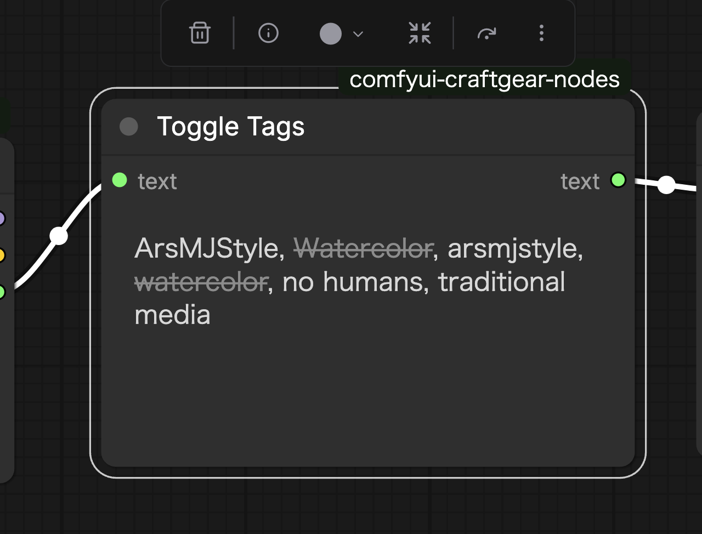

# Toggle Tags

## Features

- Displays input tag text and allows toggling tags on/off with a click.
- Disabled tags are shown with strikethrough and excluded from output.
- Quickly toggle tag enable/disable during workflow execution.

## Input Parameters

| Parameter | Type | Description |
|-----------|------|-------------|
| text | STRING | Comma-separated tag text (socket input required) |

## Outputs

| Output | Type | Description |
|--------|------|-------------|
| text | STRING | Text with only enabled tags joined by commas |

## How to Use

1. Connect tag text to the `text` input.
2. Click on a tag displayed in the node to disable it.
3. Disabled tags are shown with strikethrough and are not included in the output.
4. Click again to re-enable.

## Display

- Enabled tags: Normal display
- Disabled tags: Strikethrough + semi-transparent
- When no tags are input: Displays "(empty)"

## Usage Example

Useful for connecting to the tags output of Load LoRAs With Tags and dynamically selecting which tags to use during generation. Enable only the necessary tags from multiple available tags.
